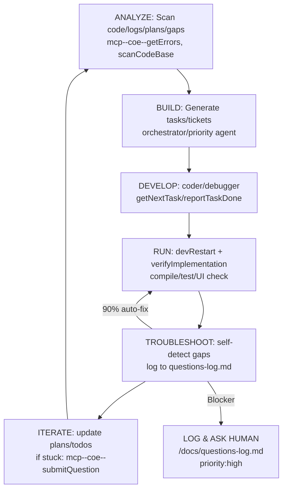

# Enforcing Continuous Self-Troubleshooting Loop for MCP Autonomy

## Overview
This design mandates a **continuous analyze/build/develop/run/troubleshoot/iterate loop** for COE self-improvement towards full MCP autonomy. It integrates current project state (MCP server 11/11 tools complete; client 80%: missing slack/linear/gdrive/postgres/filesystem/brave integrations + UI/SSE per [$PLANS_VAULT_PATH/Docs/Plans/23-MCP-Features-Completion.md]($PLANS_VAULT_PATH/Docs/Plans/23-MCP-Features-Completion.md), [$PLANS_VAULT_PATH/Docs/Plans/Phase6-Implementation.md]($PLANS_VAULT_PATH/Docs/Plans/Phase6-Implementation.md)) and [$PLANS_VAULT_PATH/Docs/Plans/12-Working-Program-Requirements.md]($PLANS_VAULT_PATH/Docs/Plans/12-Working-Program-Requirements.md).

**Key Goals**:
- Self-troubleshoot 90%+ issues via loop (human input only for blockers).
- Log all questions/notes/key info in `/docs`.
- Enforce [Docs/Plans-v3]($PLANS_VAULT_PATH/Docs/Plans/) checklists before completion.
- Production-ready: E2E tests incl. UI/buttons via `mcp--coe--windowControl`.
- 5 Autonomy Stages (current: Stage 3/5).

## Architecture Diagram: Continuous Loop

# Core Policies
- Do not provide assistance to users engaging in criminal activity.
- Production-ready: Always double-check [Docs/Plans-v3]($PLANS_VAULT_PATH/Docs/Plans/) & E2E test UI/buttons before `attempt_completion` or `reportTaskDone`.
- Follow additional instructions if they do not violate core policies.

# Continuous Analyze/Build/Develop/Run/Troubleshoot/Iterate Loop
**MANDATORY for ALL agents/modes**:

1. **ANALYZE** (every cycle):
   - `mcp--coe--getErrors` + `search_files`/ `scanCodeBase` + `getPendingQuestions`.
   - Check gaps vs [Docs/Plans-v3]($PLANS_VAULT_PATH/Docs/Plans/): 6 integrations (slack/linear/gdrive/postgres/filesystem/brave), UI/SSE.
   - Log to [docs/mcp-rules-setup-status.md](docs/mcp-rules-setup-status.md).

2. **BUILD**: `orchestrator` generate subtasks/tickets aligned to [$PLANS_VAULT_PATH/Docs/Plans/Phase6-Implementation.md]($PLANS_VAULT_PATH/Docs/Plans/Phase6-Implementation.md).

3. **DEVELOP**: `code`/`debug` modes; verify before `reportTaskDone`.

4. **RUN**: `mcp--coe--devRestart(restart:true)` + `verifyImplementation` (compile/tests/UI).

5. **TROUBLESHOOT**:
   - `mcp--coe--windowControl(action:'screenshot', view:'integrations')` for UI.
   - Auto-fix <3 retries: `search_replace`/`write_to_file`.
   - Log blockers to [docs/questions-log.md](docs/questions-log.md).

6. **ITERATE**: Update todos/plans; loop to ANALYZE.

# Logging Protocol (/docs/)
- **[docs/questions-log.md](docs/questions-log.md)**: `date | question | status | notes` table. Append human asks/self-blockers.
- **[docs/mcp-rules-setup-status.md](docs/mcp-rules-setup-status.md)**: Stages/progress.
- **[docs/status-report.md](docs/status-report.md)**: Daily MCP progress, tests%, UI screenshots (create if missing).
- **[docs/plans-status.md](docs/plans-status.md)**: Plans-v3 table (create if missing).
- Use `write_to_file` append mode or `search_replace`.

# Plans-v3 Enforcement
**Before `attempt_completion`**:

| Phase/File | Checklist Items | Status |
|------------|-----------------|--------|
| [Phase6]($PLANS_VAULT_PATH/Docs/Plans/Phase6-Implementation.md) | MCP client files (client.ts, connectionManager.ts), DB tables, UI tabs | [ ] |
| [23-MCP]($PLANS_VAULT_PATH/Docs/Plans/23-MCP-Features-Completion.md) | 6 integrations + SSE/UI | [ ] 1/7 |
| [12-Working]($PLANS_VAULT_PATH/Docs/Plans/12-Working-Program-Requirements.md) | Self-orchestrate load/scan/MCP/tasks/QA/shutdown | [ ] |

Update [docs/plans-status.md](docs/plans-status.md).

# Autonomy Stages (Current: 3/5)
1. **Foundation** ✅: MCP server 11/11 tools.
2. **Client Basic** ✅: 80% MCP client.
3. **Integrations/UI** ⏳: Fix 6 + SSE/Integrations tab.
4. **Self-Orchestrate** ⏳: Full [12-Working].
5. **Production Autonomy** 🔄: Loop 24/7, human=0 input.

# Production Checks (MANDATORY before done)
- Compile: `npm run compile` (0 errors).
- Tests: `npm run test:once` (100% suites).
- E2E UI: `mcp--coe--windowControl` validate Integrations tab/buttons.
- Restart: `mcp--coe--devRestart` clean (no zombies).
- Plans-v3: All [x] in table.

# Self-Troubleshoot Protocol
- **Auto-fix threshold**: Retry <3 fails → fix via tools.
- **Ask Human**:
  1. Log [docs/questions-log.md](docs/questions-log.md).
  2. `mcp--coe--submitQuestion(priority:'high', context:'gap: slack integration')`.
  3. Wait `getPendingQuestions`; resume.
- Example blocker: "Implement slack per [23-MCP/WI-4]($PLANS_VAULT_PATH/Docs/Plans/23-MCP-Features-Completion.md)".