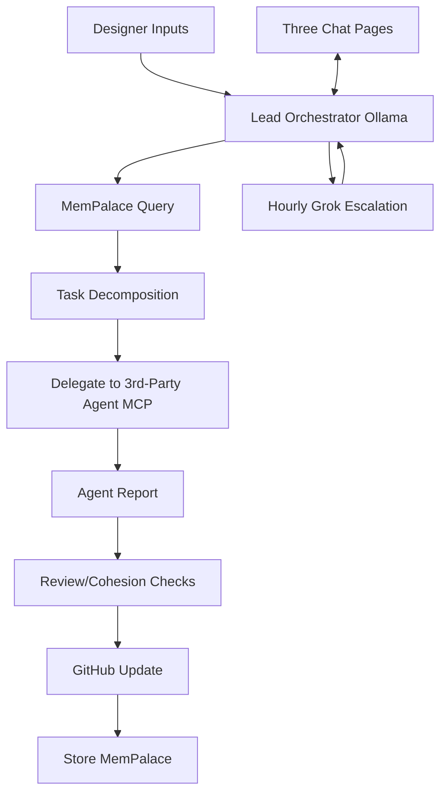

# DevLead MCP Master Plan

## Documentation Standards
- **Comprehensive Coverage**: Every module, function, and component must have clear, concise documentation including purpose, inputs/outputs, usage examples, and edge cases.
- **Markdown-First**: Use Markdown for all docs (README.md, architecture.md, API docs). Include Mermaid diagrams for architecture, workflows, and data flows.
- **Auto-Generation**: Leverage MCP tools to auto-generate/update docs on milestones (e.g., API schemas, coverage reports).
- **Versioned & Centralized**: All docs in root + /docs. Link to decision-log.md for rationale. Update on every PR merge.
- **Accessibility**: Follow inclusive standards (alt text, semantic structure, dark mode previews).

## Testing Strategy
- **Pyramid Approach**: 70% unit tests, 20% integration, 10% E2E.
- **Tools**: Jest/Vitest for JS, pytest for Python; coverage >90%; MCP code-exec for verification.
- **CI/CD Integration**: GitHub Actions for lint, type-check, tests, security scans on PRs.
- **Agent Testing**: Post-delegation: run full suite via MCP; fail → re-delegate or escalate.
- **Chaos/Edge**: Simulate failures (network, VRAM overload) in Phase 3.

## GitHub Issues Workflow
- **Single Source of Truth**: All tasks/backlog as Issues (epics for phases, atomic for delegations).
- **Labels/Templates**: `type:task`, `status:backlog|in-progress|review|done`; auto-create from Lead decomposition.
- **Automation**: Lead creates/updates Issues/PRs via GitHub MCP. Dependabot/security alerts auto-prioritized.
- **Linking**: Every delegation references Issue #. PRs link to parent Issue.
- **Cleanup**: Close on merge; archive resolved in milestones.

## Core Principles & Vision
DevLead MCP is a **pure intelligent orchestrator** (AI Programming Lead) that delegates exclusively to 3rd-party coding agents (Roo Code primary). Polsia-inspired autonomy, local-first hybrid (Ollama ~25GB + hourly Grok 4.1 Fast), 100% MCP-native, three chat pages, minimal user interference.

## High-Level Architecture
- **Lead Agent**: Local Ollama (Qwen3.5-32B Q5_K_M) + hourly Grok escalation.
- **3rd-Party Agents**: Roo Code, Copilot, etc. via MCP delegation.
- **MCP Layer**: Filesystem, GitHub, Postgres, code-exec, delegation tools.
- **State**: Shared Postgres + cloud storage.
- **UI**: Next.js with three chats: Coding Relay, User Guidance, Execution Log.
- **Heartbeat**: OpenClaw-style (30s-5min intervals, SOUL.md personality).

## Detailed Workflow
1. Ingest plan/docs → structure artifacts.
2. Heartbeat loop: State read → decompose → delegate 1-N tasks.
3. Agent executes → reports via MCP.
4. Review: Validate, checks, GitHub, store memory.
5. User Guidance for skippable Qs.
6. Hourly Grok for strategy.

## Integrations
- **MemPalace**: Verbatim hierarchical memory (Wings/Halls/Rooms) via MCP for long-term recall.
- **AutoGPT**: Delegated for non-coding research/planning sub-tasks.
- **OpenClaw Heartbeat**: Persistent daemon, proactive pivots within guardrails (no external actions).
- **Pure-Orchestrator**: Never codes; enforces standards.
- **MCP-First**: All ops via discoverable servers.
- **Local-Hybrid**: 95% local; hourly Grok.
- **3rd-Party Agents Only**: User-configured mapping.

## User Preferences & Smart Agent Model Mapping
**Core Strategy (per user note on different agent models)**: Each mode uses a dedicated, optimized LM for intelligent behavior:
- `design-lead`: High-level strategist (grok-4.20 or equivalent) — focuses on architecture, prioritization, reports.
- `orchestrator`: Coordination specialist — excels at task breakdown, delegation sequencing, workflow planning.
- `code`: Implementation coder LM — optimized for writing, refactoring, best practices.
- `architect`: Planning/UX LM.
- `debug`: Troubleshooting/diagnostics LM.
- `security-review`, `documentation-writer`, `jest-test-engineer`, `user-story-creator`, `devops`, etc.: Domain-specific LMs (e.g., security-audit model, test-specialist).
- `skill-writer`, `mode-writer`: Meta-capability LMs.

**Implementation**:
- Configurable per-mode mapping in preferences (JSON/Postgres).
- Heartbeat/SOUL respects mapping for smart routing: always plan with Orchestrator LM before delegating to Code LM, etc.
- UI editor in User Guidance tab for editing mappings, parallelism (max concurrent), approval thresholds, toggles (MemPalace, AutoGPT, heartbeat interval), planning rigor.
- Persisted state; loaded on startup; dynamic mode creation support.

## Roadmap
- **Phase 1 MVP** ✓ **Complete** — Local Lead, three chats, heartbeat, SOUL, .mcp.json, red→green test baseline. Retrospective plan: [`AI plans/phase-1-plan.md`](phase-1-plan.md) (D-20260419-020).
- **Phase 2** ✓ **Complete** — Preferences editor, smart multi-agent model mapping, planning-enforcement suite (single-task rule, decision IDs, run reports, Dev-Q&A, 5-area framework, multi-layer sub-issues, companion GH Issues, naming conventions). Retrospective plan: [`AI plans/phase-2-plan.md`](phase-2-plan.md) (D-20260419-021).
- **Phase 3** — **In progress** — Cohesion/checks layer, multi-project scaffold, UI upgrade (shell + routes + TopBar + LeftRail + MainPanes + shadcn primitives already landed via #24 + #104), heartbeat hardening, observability, release-gate surfaces. Plan: [`AI plans/phase-3-plan.md`](phase-3-plan.md).
- **Phase 4** — **Planned** — PM2/task-scheduler supervision, GitHub Actions CI gating, one-command install, production observability, release automation. Plan: [`AI plans/phase-4-plan.md`](phase-4-plan.md).

## Considerations
Security (MCP least-priv), multi-project isolation, VRAM monitoring, fallbacks, etc. Full list consolidated from originals.

**Locked & Ready-to-Build.**