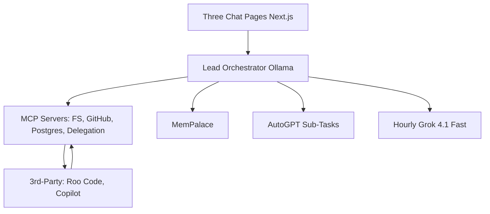

# Architecture

## High-Level Diagram

## Components
- **Lead**: Planning/delegation/review.
- **MCP**: Gateway for all I/O.
- **Memory**: MemPalace for persistence.
- **Agents**: External coding only.
- **State**: Shared DB/storage.
- **UI**: Transparent monitoring.

Details in [plans/main-plan.md](plans/main-plan.md).