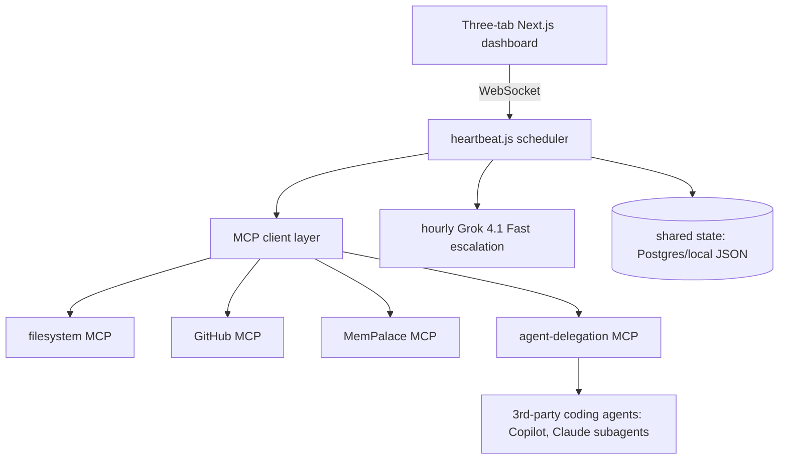

# Architecture

## Current state (v1, as of D-20260418-017)

The current runtime is **`heartbeat.js` v1**. It still emits read-oriented tick reports, and it now also loads `.mcp.json`, attempts MCP server connections through `lib/mcp-client.js`, and renders MCP status blocks (connected/failed/skipped) into `reports/heartbeat-tick-*.md`.

```
┌────────────────────────────────────────────────────────────────┐
│                      heartbeat.js v0 (Node.js)                 │
│                                                                │
│   one-shot mode: `node heartbeat.js`                           │
│   watch mode:    `node heartbeat.js --watch`                   │
│                  HEARTBEAT_INTERVAL_MS env, default 60_000     │
│                                                                │
│   per tick:                                                    │
│     • git branch + short SHA      (shell: git)                 │
│     • open Issue counts by label  (shell: gh issue list --json)│
│     • latest reports/run-*.md     (fs)                         │
│     • last 3 Decision IDs         (fs, parse decision-log.md)  │
│   ↓                                                            │
│   writes reports/heartbeat-tick-<ISO>.md                       │
└────────────────────────────────────────────────────────────────┘
```

Pure helpers (`parseGitState`, `parseIssueCounts`, `findLatestRunReport`,
`summariseRunReport`, `extractRecentDecisions`, `formatTickReport`) are
tested via `tests/heartbeat.test.js` using Node's built-in `node:test`
runner — zero test-framework dependencies at repo root.

Side-effectful wrappers (`readGitState`, `readIssueCounts`, etc.) shell out
to `git` and `gh` and read from the filesystem. All are null-safe; a
missing file or failing shell-out downgrades to a placeholder in the tick
report instead of crashing the loop.

### Components present today
| Component | Status | File |
|---|---|---|
| heartbeat.js v1 (tick + MCP status reporting) | working | `heartbeat.js` |
| Tick tests | 24 passing | `tests/heartbeat.test.js` |
| MCP client wrapper + tests | working | `lib/mcp-client.js`, `tests/mcp-client.test.js` |
| Dashboard (operator view, prototype) | working | `dashboard/app/page.tsx` |
| Dashboard preferences tests | 12/12 passing | `dashboard/__tests__/preferences.test.tsx` |
| Heartbeat legacy (Run-2 Roo-era stub) | preserved for history | `heartbeat.legacy.js` |

### Components the target diagram references but that are **not yet fully present**
- Lead orchestrator LLM (Ollama / Grok escalation)
- Full MCP transport matrix (today: stdio connect path implemented; remote transports are skipped with explicit reasons)
- MemPalace persistence wiring (server installed, but not yet called from `heartbeat.js`)
- 3rd-party agent delegation (GitHub Copilot / Claude Code subagents — never Roo Code per D-20260417-006)
- Shared state DB
- WebSocket feed from `heartbeat.js` → dashboard Execution Log tab
- Hourly Grok escalation

Each of these is a future atomic Issue off the core-backbone plan. See
`plans/main-plan.md` for phase-level grouping and GitHub Issues for the
current ready-to-go queue.

---

## Target high-level diagram (future state)

This is the shape the product is working toward. It is **not** what runs
today.



### Components (target)
- **heartbeat.js**: planning/decomposition/delegation/review loop (Polsia
  5-rule cadence; currently v0 read-only tick).
- **MCP layer**: gateway for all I/O — filesystem, GitHub, state, delegation.
  Today `.mcp.json` declares stdio servers for `mempalace`,
  `sequentialthinking`, `context7`, `puppeteer`, `memory`,
  `microsoft-learn`. `heartbeat.js` does not yet use any of them.
- **Memory**: MemPalace for cross-run observations; generic `memory` MCP as
  fallback.
- **Agents**: External coding-only — GitHub Copilot via hosted MCP and
  Claude Code subagents dispatched from this runtime. Roo Code is
  explicitly out of scope (D-20260417-006).
- **State**: Shared DB + cloud storage in Phase 3+; local filesystem reports
  for v0.
- **UI**: Three-tab Next.js dashboard for transparent monitoring (see
  `Docs/Plans/Part 6 UI Master Plan.md`; current prototype is a wireframe
  tracked in epic Issue #19).

Details in [`plans/main-plan.md`](plans/main-plan.md) and
[`Docs/Plans/`](Docs/Plans/) (Parts 1-6).
