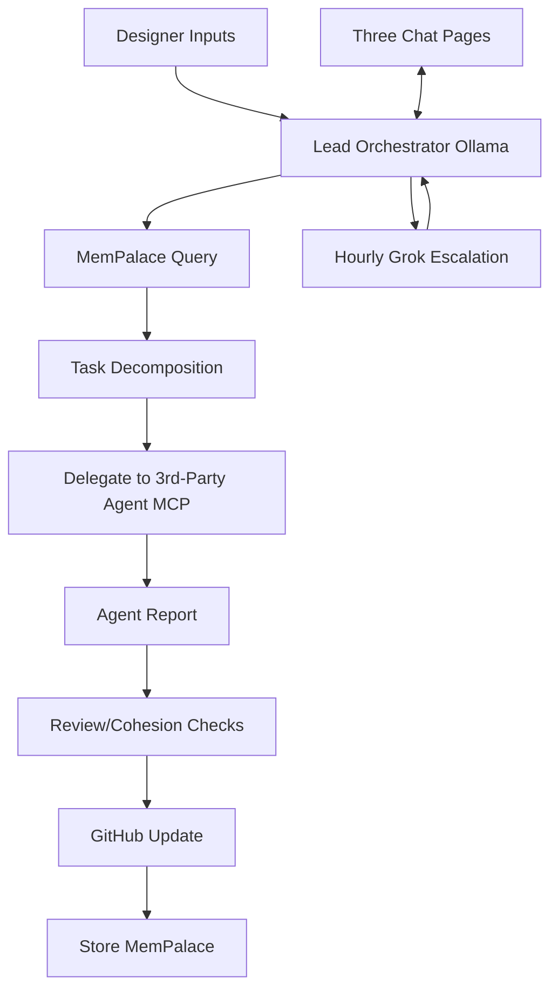

# DevLead MCP Master Plan

## Documentation Standards
- **Comprehensive Coverage**: Every module, function, and component must have clear, concise documentation including purpose, inputs/outputs, usage examples, and edge cases.
- **Markdown-First**: Use Markdown for all docs (README.md, architecture.md, API docs). Include Mermaid diagrams for architecture, workflows, and data flows.
- **Auto-Generation**: Leverage MCP tools to auto-generate/update docs on milestones (e.g., API schemas, coverage reports).
- **Versioned & Centralized**: All docs in root + /docs. Link to decision-log.md for rationale. Update on every PR merge.
- **Accessibility**: Follow inclusive standards (alt text, semantic structure, dark mode previews).

## Testing Strategy
- **Pyramid Approach**: 70% unit tests, 20% integration, 10% E2E.
- **Tools**: Jest/Vitest for JS, pytest for Python; coverage >90%; MCP code-exec for verification.
- **CI/CD Integration**: GitHub Actions for lint, type-check, tests, security scans on PRs.
- **Agent Testing**: Post-delegation: run full suite via MCP; fail → re-delegate or escalate.
- **Chaos/Edge**: Simulate failures (network, VRAM overload) in Phase 3.

## GitHub Issues Workflow
- **Single Source of Truth**: All tasks/backlog as Issues (epics for phases, atomic for delegations).
- **Labels/Templates**: `type:task`, `status:backlog|in-progress|review|done`; auto-create from Lead decomposition.
- **Automation**: Lead creates/updates Issues/PRs via GitHub MCP. Dependabot/security alerts auto-prioritized.
- **Linking**: Every delegation references Issue #. PRs link to parent Issue.
- **Cleanup**: Close on merge; archive resolved in milestones.

## Core Principles & Vision
DevLead MCP is a **pure intelligent orchestrator** (AI Programming Lead) that delegates exclusively to 3rd-party coding agents (Roo Code primary). Polsia-inspired autonomy, local-first hybrid (Ollama ~25GB + hourly Grok 4.1 Fast), 100% MCP-native, three chat pages, minimal user interference.

## High-Level Architecture
- **Lead Agent**: Local Ollama (Qwen3.5-32B Q5_K_M) + hourly Grok escalation.
- **3rd-Party Agents**: Roo Code, Copilot, etc. via MCP delegation.
- **MCP Layer**: Filesystem, GitHub, Postgres, code-exec, delegation tools.
- **State**: Shared Postgres + cloud storage.
- **UI**: Next.js with three chats: Coding Relay, User Guidance, Execution Log.
- **Heartbeat**: OpenClaw-style (30s-5min intervals, SOUL.md personality).

## Detailed Workflow
1. Ingest plan/docs → structure artifacts.
2. Heartbeat loop: State read → decompose → delegate 1-N tasks.
3. Agent executes → reports via MCP.
4. Review: Validate, checks, GitHub, store memory.
5. User Guidance for skippable Qs.
6. Hourly Grok for strategy.

## Integrations
- **MemPalace**: Verbatim hierarchical memory (Wings/Halls/Rooms) via MCP for long-term recall.
- **AutoGPT**: Delegated for non-coding research/planning sub-tasks.
- **OpenClaw Heartbeat**: Persistent daemon, proactive pivots within guardrails (no external actions).
- **Pure-Orchestrator**: Never codes; enforces standards.
- **MCP-First**: All ops via discoverable servers.
- **Local-Hybrid**: 95% local; hourly Grok.
- **3rd-Party Agents Only**: User-configured mapping.

## User Preferences
Dashboard-editable: Agent mapping, parallelism, approvals, heartbeat interval, MemPalace/AutoGPT toggles, etc.

## Roadmap
- **Phase 1 MVP**: Local Lead, Roo delegation, three chats, heartbeat.
- **Phase 2**: Prefs, multi-agent.
- **Phase 3**: Checks, multi-project.
- **Phase 4**: Production scale.

## Considerations
Security (MCP least-priv), multi-project isolation, VRAM monitoring, fallbacks, etc. Full list consolidated from originals.

**Locked & Ready-to-Build.**